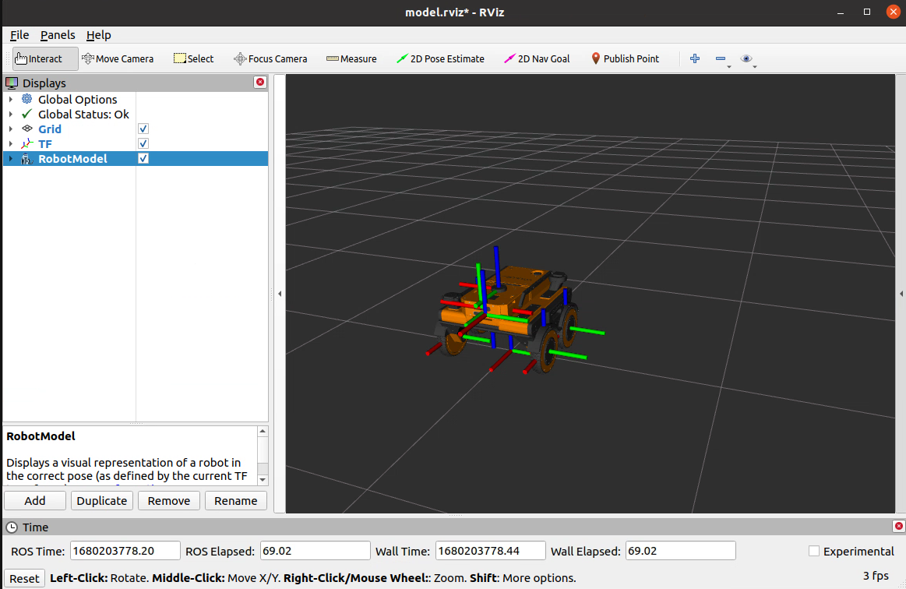

# vitulus_description
 URDF description of VITULUS. Package publish robot state, joints, tf. 

### NODES
  /
    joint_state_publisher (joint_state_publisher/joint_state_publisher)
    robot_state_publisher (robot_state_publisher/robot_state_publisher)

## Install

`cd ~/catkin_ws/src/vitulus`

`git clone https://github.com/lacina-dev/vitulus_description.git`

`cd ~/catkin_ws`

`catkin build`

## Run

`roslaunch vitulus_description vitulus4wd.launch rviz:=true joint_state_publisher:=true`

## Info

 More about VITULUS? See my website.
 [https://lacina.dev](https://lacina.dev)

 Questions? Try Discord.
 [Discord channel](https://discord.gg/YqeNV5hEVN)